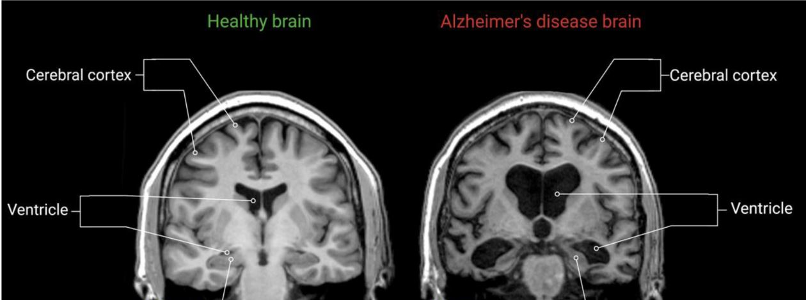
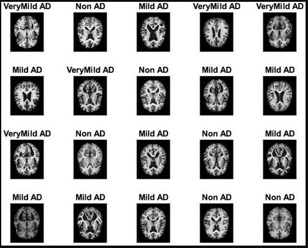

# Early Alzheimer's Diagnoses with CNN
## Maladie d’Alzheimer et sa progression
La maladie d’Alzheimer est une maladie neurodégénérative progressive qui affecte principalement la mémoire, les fonctions cognitives et le comportement. C’est la cause la plus fréquente de démence chez les personnes âgées.

  

**1. Physiopathologie**
- Accumulation anormale de protéines bêta-amyloïdes formant des plaques dans le cerveau.
- Formation de dégénérescences neurofibrillaires dues à la protéine tau.
- Ces anomalies entraînent la mort des neurones et une réduction du volume cérébral, particulièrement dans l’hippocampe et le cortex.
**2. Stades de la maladie**
La progression d’Alzheimer est généralement divisée en quatre stades principaux :
*a. Aucun déficit (No Impairment)*
- Pas de symptômes cliniques.
- Fonction cognitive normale.
*b. Troubles très légers (Very Mild Impairment)*
- Oublis occasionnels de mots ou d’objets.
- Légère perte de mémoire à court terme, souvent confondue avec le vieillissement normal.
*c. Troubles légers à modérés (Mild/Moderate Impairment)*
- Difficultés croissantes pour accomplir des tâches quotidiennes (gestion de finances, organisation).
- Oublis plus fréquents, désorientation spatiale et temporelle.
*d. Troubles sévères (Severe Impairment)*
- Perte importante de mémoire et des fonctions cognitives.
- Incapacité à reconnaître des proches, troubles du langage et dépendance totale pour les activités de la vie quotidienne.

  

**3. Importance du diagnostic précoce**
Détecter la maladie avant l’apparition des symptômes sévères permet :
- Une meilleure gestion clinique et thérapeutique.
- La planification de soins adaptés.
- La possibilité de ralentir la progression grâce aux traitements disponibles.

## Motivation du recours au Deep Learning pour la détection de l’Alzheimer
La maladie d’Alzheimer est une pathologie neurodégénérative complexe dont le diagnostic repose principalement sur l’analyse d’images cérébrales (IRM). Cependant, l’interprétation manuelle de ces images est difficile, longue et sujette à des erreurs humaines, surtout dans les stades précoces où les changements sont très subtils.
Le Deep Learning (DL), et plus particulièrement les réseaux de neurones convolutifs (CNN), offre une solution performante pour automatiser et améliorer cette détection. Grâce à leur capacité à extraire automatiquement des caractéristiques discriminantes des images, ces modèles permettent :
- d’identifier les anomalies cérébrales associées à la maladie,
- d’améliorer la précision du diagnostic,
- et de réduire le temps d’analyse pour les cliniciens.
Ainsi, l’application du DL à la classification d’IRM dans le cadre d’Alzheimer contribue à un diagnostic plus rapide, objectif et fiable.

## Jeu de données
Le jeu de données utilisé provient de Kaggle, intitulé “Best Alzheimer MRI Dataset (99% Accuracy)”. Il contient des images IRM cérébrales classées selon différents stades de la maladie d’Alzheimer.
Les données sont réparties en plusieurs catégories (ou classes) représentant les différents niveaux de progression de la maladie, tels que :
- Non Demented : sujets sains sans signes de démence,
- Very Mild Demented : premiers signes légers de déclin cognitif,
- Mild Demented : stade intermédiaire de la maladie,
- Moderate Demented : stade avancé avec perte cognitive notable.
Chaque classe contient plusieurs centaines d’images IRM, permettant d’entraîner un modèle de Deep Learning capable de distinguer automatiquement les différents stades.
Avant l’entraînement, les images sont redimensionnées, normalisées et organisées par classes afin de garantir une bonne qualité d’apprentissage et d’évaluation.

## Modèle CNN proposé
Pour la détection et la classification des stades de la maladie d’Alzheimer, nous avons utilisé un modèle basé sur ResNet50, renforcé par des couches CNN supplémentaires.
- ResNet50 est un réseau de neurones convolutionnel profond connu pour sa capacité à extraire des caractéristiques visuelles complexes grâce à son architecture à résidus (skip connections) qui évite le problème du vanishing gradient.
- Ce modèle sert ici de base d’extraction de caractéristiques.
- Des couches convolutionnelles supplémentaires ont été ajoutées pour affiner l’apprentissage aux spécificités des IRM cérébrales.
- Enfin, des couches fully connected et Dropout ont été intégrées pour la classification finale et pour réduire le surapprentissage.
Le modèle prend en entrée des images de taille normalisée et produit en sortie une prédiction multi-classes correspondant aux différents stades d’Alzheimer (Non, Very Mild, Mild, Moderate).

## Paramètres d’entraînement du modèle
**Compilation du modèle**

Le modèle a été compilé avec les paramètres suivants :
- Optimiseur : Adam avec un learning rate de 1e-4, connu pour sa stabilité et sa capacité à bien s’adapter pendant l’entraînement.
- Fonction de perte : categorical_crossentropy, adaptée à un problème de classification multi-classes.
- Métrique de suivi : accuracy (taux de précision).
  
**Callbacks utilisés**

Deux callbacks ont été utilisés pour optimiser l’apprentissage :
- EarlyStopping : interrompt l’entraînement lorsque la perte de validation ne s’améliore plus pendant 10 époques, tout en restaurant les meilleurs poids du modèle.
- ReduceLROnPlateau : réduit le taux d’apprentissage de 80 % si la perte de validation stagne sur 5 époques consécutives.
→ Cela permet d’éviter le surapprentissage et d’améliorer la convergence.

**Processus d’entraînement**

- Batch size : 32
- Nombre maximal d’époques : 100
- Augmentation de données activée (rotation, zoom, flips, etc.)
- Jeu de validation : 20 % des données totales

## Évaluation du modèle
- Les premières époques montrent une progression lente (acc ~0.30 → 0.70).
- À partir de la 15ᵉ époque, le modèle atteint une stabilité notable avec des val_loss en baisse continue.
- Le ReduceLROnPlateau a réduit progressivement le learning rate à 2e-5, puis 4e-6, améliorant la précision.

## Résultats finaux
Après 82 époques (avant arrêt anticipé) :
- Précision d’entraînement (accuracy) : ≈ 96 %
- Précision de validation (val_accuracy) : ≈ 96 %
- Perte de validation (val_loss) : ≈ 0.08
